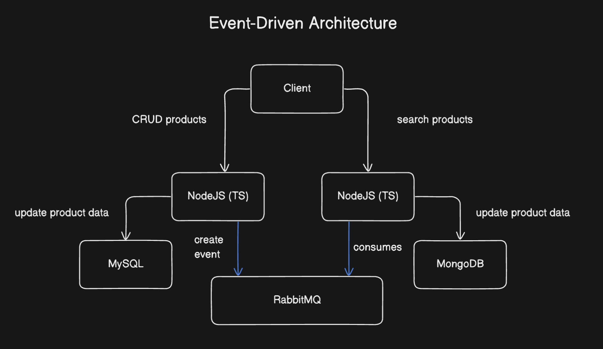
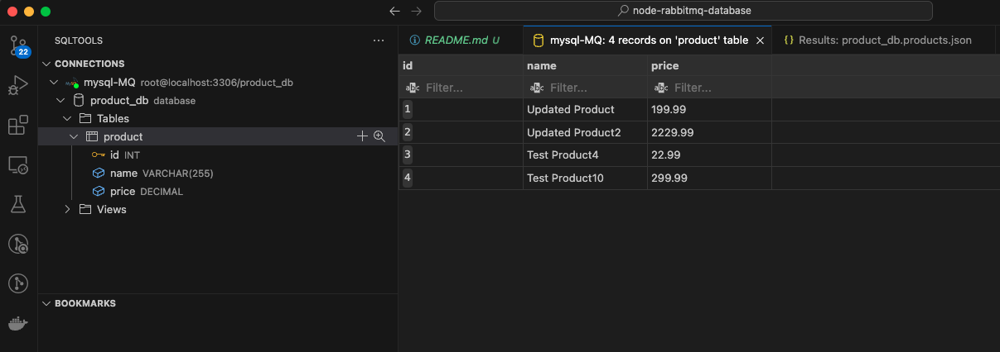
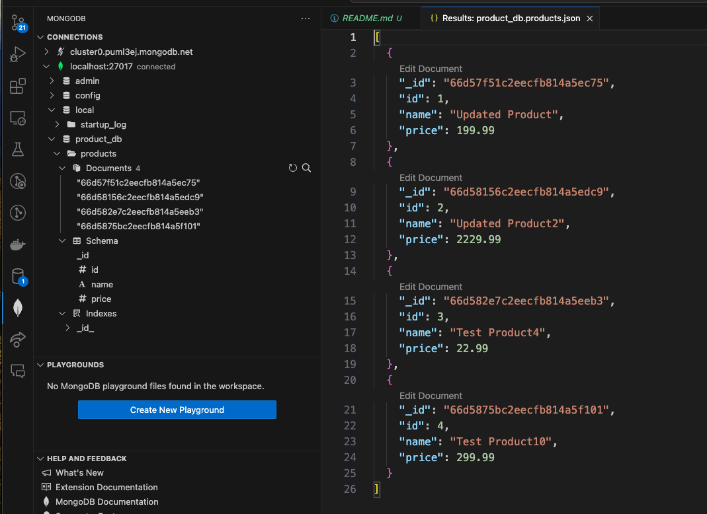
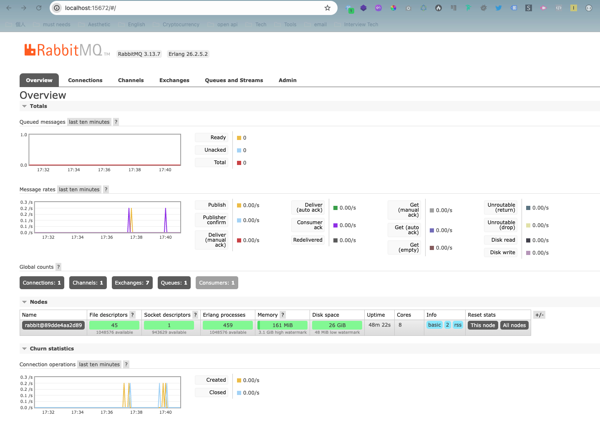
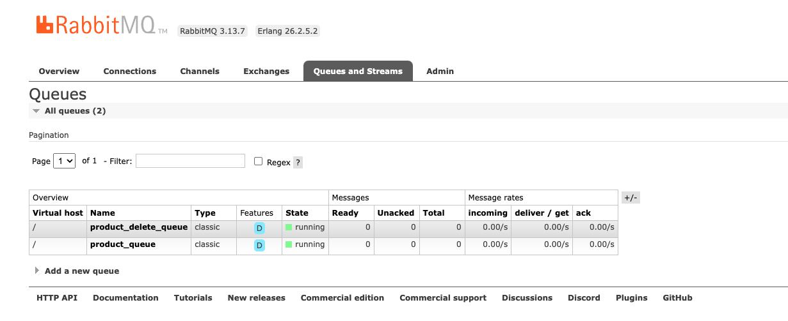

# Event-Driven Architecture: MySQL to MongoDB with RabbitMQ

This project demonstrates an event-driven architecture using Node.js, Express, TypeScript, MySQL, MongoDB, and RabbitMQ. The architecture is split into two services: one for handling CRUD operations on products and another for consuming RabbitMQ messages to update MongoDB.




## Table of Contents

- [Overview](#overview)
- [Architecture](#architecture)
- [Technologies Used](#technologies-used)
- [Setup and Installation](#setup-and-installation)
  - [Prerequisites](#prerequisites)
  - [Service 1: Product CRUD API](#service-1-product-crud-api)
  - [Service 2: Queue Consumer](#service-2-queue-consumer)
- [Usage](#usage)

## Overview

This project showcases an event-driven system where:
- **Service 1** provides a REST API to perform CRUD operations on products stored in MySQL using TypeORM.
- **Service 2** consumes messages from RabbitMQ to update the product information in MongoDB.

## Architecture

1. **Service 1: Product CRUD API**
   - Manages product data in a MySQL database.
   - Publishes CRUD operation details to a RabbitMQ queue.

2. **Service 2: Queue Consumer**
   - Listens to the RabbitMQ queue.
   - Updates the product information in MongoDB based on the messages received.

## Technologies Used

- **Node.js**: JavaScript runtime for building scalable applications.
- **Express**: Web framework for building APIs.
- **TypeScript**: Superset of JavaScript for type safety and modern syntax.
- **TypeORM**: ORM for interacting with MySQL.
- **MySQL**: Relational database for storing product data.
- **MongoDB**: NoSQL database for storing and updating product information.
- **RabbitMQ**: Message broker for handling communication between services.
- **Docker**: Containerization platform for running MySQL, MongoDB, and RabbitMQ.

## Setup and Installation

### Prerequisites

Ensure you have the following installed:

- Node.js and npm
- Docker and Docker Compose

## Usage

1.	Install dependencies:

```bash
  npm install
```

3.	Set up the environment variables in a .env file:

```bash
  MYSQL_HOST=localhost
  MYSQL_PORT=3306
  MYSQL_USERNAME=root
  MYSQL_PASSWORD=rootpassword
  MYSQL_DATABASE=product_db
  RABBITMQ_URL=amqp://localhost
```

4. Start Docker containers for MySQL, MongoDB, and RabbitMQ

```
  docker-compose up -d
```

6.	Run the service:

```bash
  npm run start
```

7.	Queue Consumer

```bash
  // Navigate to the consumer service directory
  cd product-consumer-service
  npm install
```
8. Set up the environment variables in a .env file within consumer service directory

```bash
  MONGODB_URL=mongodb://localhost:27017
  RABBITMQ_URL=amqp://localhost
```

9.	Run consumer service:

```bash
  // In consumer service directory
  npm run start
```

10. Try it
Login RabbitMQ Server: http://localhost:15672/
Default: guest, guest

```bash

  // Get all products
  curl -X GET http://localhost:3000/products

  // Create a product
  curl -X POST http://localhost:3000/products \
    -H "Content-Type: application/json" \
    -d '{"name": "Test Product", "price": 99.99}'
  curl -X POST http://localhost:3000/products \
    -H "Content-Type: application/json" \
    -d '{"name": "Test Product2", "price": 199.99}'

  // Update product
  curl -X PUT http://localhost:3000/products/1 \
    -H "Content-Type: application/json" \
    -d '{"name": "Updated Product", "price": 199.99}'
  curl -X PUT http://localhost:3000/products/2 \
    -H "Content-Type: application/json" \
    -d '{"name": "Updated Product2", "price": 9.99}'
```

MySQL Data



MongoDB Data



RabbitMQ Server


